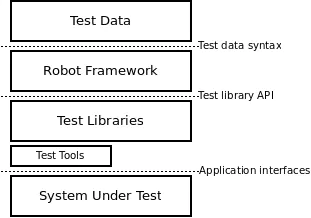
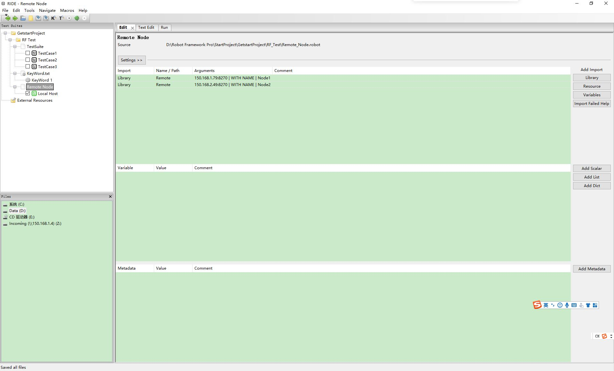
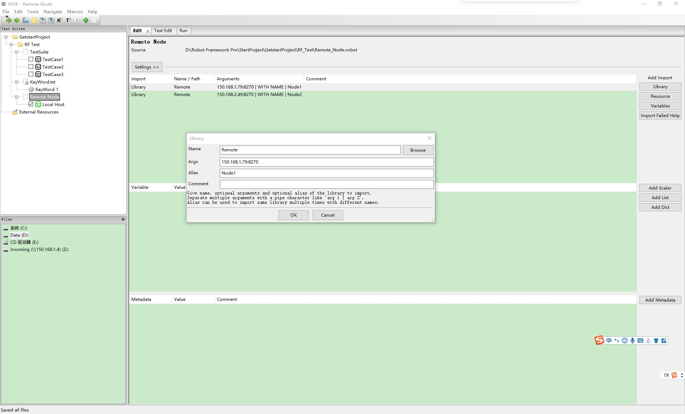
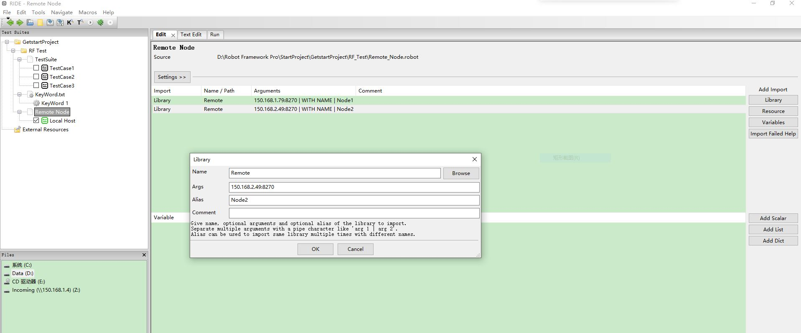
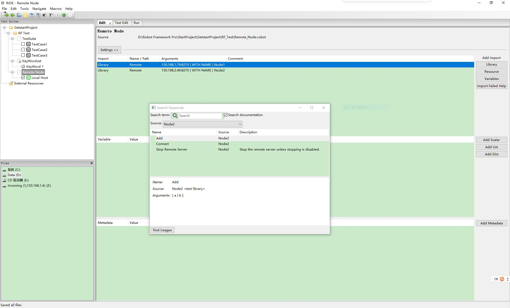

# 1.什么是RF 

Robot Framework Robot Framework是一个基于Python的，可扩展的关键字驱动的测试自动化框架，具备良好的可扩展性，支持关键字驱动，用于端到端验收测试和验收测试驱动开发（ATDD）。它可用于测试分布式异构应用程序，其中验证需要涉及多种技术和接口。

RF 特性：
- 启用易于使用的表格语法，以统一的方式创建测试用例。
- 提供从现有关键字创建可重复使用的更高级别关键字的功能。
- 提供易于阅读的结果报告和HTML格式的日志。
- 平台和应用程序是独立的。
- 提供一个简单的库API，用于创建自定义测试库，可以使用Python或Java本机实现。
- 提供命令行界面和基于XML的输出文件， 以便集成到现有构建基础架构（持续集成系统）中。
- 为Selenium提供Web测试，Java GUI测试，运行进程，Telnet，SSH等支持。
- 支持创建数据驱动的测试用例。
- 内置对变量的支持，特别适用于不同环境下的测试。
- 提供标记以分类和选择要执行的测试用例。
- 实现与源代码控制的轻松集成：测试套件只是可以使用生产代码进行版本控制的文件和目录。
- 提供测试用例和测试套件级别的设置和拆卸。
- 模块化架构支持创建测试，即使对于具有多种不同接口的应用程序。




```
所以无论是数据驱动也好，关键字驱动也好，各有自己的优劣，适合的才是最好的，会用不是目的，用好，能解决问题，提高效率才是目的。
```
## 1.1 关键字驱动
关键字驱动的自动化测试(也称为表驱动测试自动化)，是数据驱动自动化测试的变种，可支持由不同序列或多个不同路径组成的测试。它是一种独立于应 用程序的自动化框架，在处理自动化测试的同时也要适合手工测试。关键字驱动的自动化测试框架建立在数据驱动手段之上，表中包含指令(关键词)，而不只是数 据。这些测试被开发成使用关键字的数据表，它们独立于执行测试的自动化工具。关键字驱动的自动化测试是对数据驱动的自动化测试的有效改进和补充。
1.关键字驱动测试是数据驱动测试的一种改进类型

2.主要关键字包括三类：被操作对象（Item）、操作（Operation）和值（value），用面向对象形式可将其表现为Item.Operation(Value)

3.将测试逻辑按照这些关键字进行分解，形成数据文件。

4.测试框架低层负责解释这些关键字，并完成相应的指令操作。


## 1.2 数据驱动

数据驱动的自动化测试框架是这样的一个框架，从某个数据文件(例如ODBC源文件、Excel文件、Csv文件、ADO对象文件等)中读取输入、输出 的测试数据，然后通过变量传入事先录制好的或手工编写的测试脚本中。其中，这些变量被用作传递(输入/输出)用来验证应用程序的测试数据。在这个过程中， 数据文件的读取、测试状态和所有测试信息都被编写进测试脚本里;测试数据只包含在数据文件中，而不是脚本里，测试脚本只是一个“驱动”，或者说是一个传送 数据的机制。

特点：
1) 可变数据
2) 高度抽象化的、重复的测试设
### 优点
- 减少重复劳动

- 解耦，降低准入门槛，易于测试人员修改和维护：测试开发负责开发测试脚本，手工测试人员负责准备测试数据

### 缺点

- 灵活性低，扩展受限，一组脚本只能处理特定格式的数据

- 通过数据控制（驱动）逻辑处理是短板

- 开发不同类型的脚本或增强脚本的处理逻辑，会增加复杂度，维护成本高

- 测试范围的扩大，会导致测试数据的数量和类别都非常多，维护这些数据成本会增大

- 增加学习成本

- 增加沟通成本


## 2.RF 安装

使用前安装Python 3.7，并使用pip3 安装以下的依赖包。
1.安装 RF
```
pip3 install robotframework
```
2.安装 wxPython
```
pip3 isntall wxPython
```
3.安装RIDE 编辑器
```
pip3 install robotframework-ride
```
4. MAC 用户安装RIDE 需要使用easy_install 安装

## 3.Robot Framework IDE(RIDE)编辑器使用
```
确保以上的Python 安装包已经安装，运行RIDE使用
```
RIDE 是官方开发并推荐使用的 RF 测试用例开发环境，完成 RobotFramework 的安装后，Windows 端在命令行中运行 $ python <python_path>\Scripts\ride.py，Mac 端直接输入 $ ride.py 即可打开 RIDE 编辑器。




```
缺少 RIDE的详细使用
```

## 4.分布式系统构建

构建分布式测试系统，原理：使用RPC技术架构实现多节点的测试系统的在节点执行，但是测试结果和测试数据回归至执行者或者数据库。

远程库接口提供了在运行Robot Framework本身的机器上运行测试库的方法，以及使用除本机支持的Python和Java之外的其他语言实现库的方法。对于测试库，用户远程库看起来与任何其他测试库几乎相同，使用远程库接口开发测试库也非常接近于创建普通测试库。

使用远程库API有两个主要原因：

1.与运行Robot Framework的机器不同，可以在不同的机器上安装实际库。这为分布式测试提供了更多的可能性；

2.可以使用支持XML-RPC协议的任何语言来实现测试库 。Robot Framework 包含用于Python / Jython和Ruby的通用远程服务器，实现通用服务器。

远程库接口由Remote库提供，Remote库是从Robot Framework 2.1开始的标准库之一。该库没有自己的任何关键字，但它作为核心框架和其他地方实现的关键字之间的代理。远程库通过远程服务器与实际库实现交互，远程库和服务器使用XML-RPC通道上的简单远程协议进行通信。所有这些的高级架构如下图所示：


此架构通过测试节点作为远程服务器，采用的代理模式实现，此模式需要以下3部分实现：
1. Remote Library 远程测试库，作为客户端去调用真正的测试用例；
2. Remote Server 远程服务器，运行在远程测试节点；
3. Test Libirary 测试用例库，测试库提供真正的测试功能，它被远程服务器包裹起来，通过XML-RPC协议被远程库访问；

## 4.1 构建RemoServer

```
此Remote Server运行在远程测试节点上
```
### 1. 安装RemoServer

在测试节点上安装远程测试服务接口，同时将测试库包裹在测试服务器，可被远程调用。

``` python
pip install robotremoteserver
```
### 2.远程服务
在本地创建RemoteServer.py,添加以下运行的测试用例。

```python
from __future__ import print_function
import os
import sys
from tokenize import Name
from robotremoteserver import RobotRemoteServer

try:
    basestring
except NameError:
    basestring = str


class ExampleLibrary(object):
    """
     测试用例库
    Args:
        object (_type_): _description_
    """
    def count_items_in_direcory(self,path):
        items = [i for i in os.listdir(path) if not i.startswith('.')]

        return len(items)
    
    def string_should_be_equal(self,str1,str2):
        print("Comparing '%s' to '%s'. "%(str1,str2))
        if not (isinstance(str1,basestring) and isinstance(str2,basestring)):
            raise AssertionError("Given string are not strings.")
        
        if str1 !=str2:
            raise AssertionError("Given string are not equal.")
        

if __name__ == '__main__':
    RobotRemoteServer(ExampleLibrary(),host='150.168.1.79',port=8270)
    ## host 为服务的ip,port为RPC默认的端口号，可根据节点配置
    
```

### 3.运行服务
在 命令行中运行服务
```
python3 RemoteServer.py
```
在命令行中提示以下信息，则服务运行成功。
```
D:\Robot Framework Pro\Remote Node> python .\RemoteServer.py                   
Robot Framework remote server at 150.168.1.79:8270 started.
```

### 4.RIDE 配置和使用

1. 测试套件设置


在library添加Remove，并设置IP、端口和设置别名；




2.多测试节点设置

如果需要在测试套件中使用多个测试节点远程库，需要设置给节点一个更具描述性的名称，则可以使用WITH NAME语法导入它，使节点有唯一的名字，即可创建多个节点的连接。


1. 使用测试库

在RIDE中关键字查看其中，即可识别到配置的节点，同时列出节点的测试库；



## 4.2 支持的参数和返回值类型

由于XML-RPC协议不支持所有可能的对象类型，因此必须将远程库和远程服务器之间传输的值转换为兼容类型。这适用于远程库传递给远程服务器的关键字参数，以及返回值服务器返回远程库的关键字参数。

转换使用以下规则完成：

- 字符串，数字和布尔值无需修改即可传递。
- 在无/无值被转换为一个空字符串。
- 列表（和Python中的元组）作为列表传递，以便递归地转换它们的内容。
传递字典/映射，以便递归地将它们的值转换为支持的类型，并将键转换为字符串。
其他类型转换为字符串。

## 4.3使用远程服务器
Robot Framework 包括用Python和Ruby编写的远程服务器实现。这些服务器以及下面显示的示例库和示例测试用例文件都包含在tools / remoteserver 目录下的源代码发行版中，也可以在 http://code.google.com/p/robotframework/wiki/RemoteLibrary中找到。

提供的服务器经过精心设计，因此可以轻松地使用它们创建测试库。使用这两个服务器的基本过程如下：

- 使用静态库API创建与普通测试库类似的测试库模块或类。使用Python服务器，也可以使用混合库API。
- 导入远程服务器类并创建它的实例，将库实例或模块作为参数提供给它。可能从命令行获取的侦听地址和端口可以作为可选参数给出。


## 4.4 rpc远程协议
本节介绍远程库和远程服务器之间使用的协议。主要针对想要创建新远程服务器的功能，作为构建分布式测试系统的有效工具。

远程协议是在XML-RPC之上实现的，XML-RPC是一种使用XML over HTTP的简单远程过程调用协议。大多数主流语言（Python，Java，C，Ruby，Perl，Javascript，PHP，...）都支持XML-RPC内置或扩展。